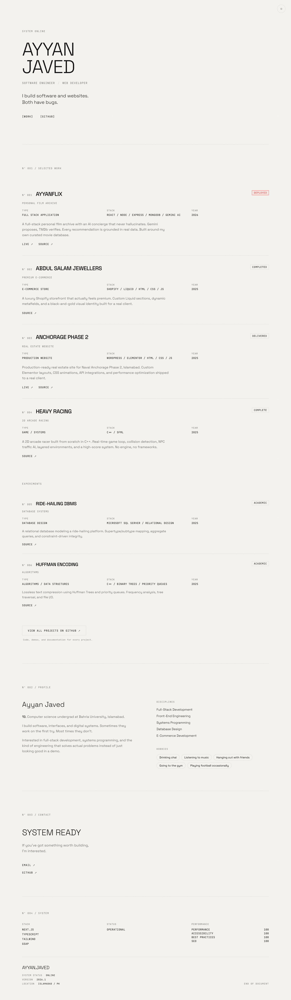

# AYYAN.JAVED — PORTFOLIO V2

> A minimalist, editorial personal portfolio built from scratch with Next.js and TypeScript.

---

<p align="center">
  
</p>

<p align="center">
  <a href="https://portfolio-ruby-ten-66.vercel.app/">
    
  </a>
</p>

<p align="center"><sub><i>⬤ deployed & operational · system online</i></sub></p>

---

## 01 · PROJECT

**AYYAN.JAVED** is my personal developer portfolio — designed to present my work, background, and contact information through a deliberately minimal interface.

Rather than using a conventional portfolio layout, the site treats the entire page as a **single interactive document**.

The design combines editorial typography with a subtle technical/terminal aesthetic:

* Structured numbered sections
* Monospace system metadata
* Editorial typography
* Light / dark themes
* Scroll-based motion
* Minimal UI
* Subtle grain texture
* Strong spacing and typography hierarchy

The goal was to make the interface feel **designed without feeling over-designed**.

---

## 02 · TECHNICAL SPECIFICATION

| FIELD         | VALUE                          |
| ------------- | ------------------------------ |
| FRAMEWORK     | Next.js 16                     |
| ARCHITECTURE  | App Router                     |
| LANGUAGE      | TypeScript                     |
| STYLING       | Tailwind CSS                   |
| ANIMATION     | GSAP + ScrollTrigger           |
| SMOOTH SCROLL | Lenis                          |
| FONT          | Space Grotesk / JetBrains Mono |
| DEPLOYMENT    | Vercel                         |
| TYPE          | Single-page application        |

---

## 03 · FEATURES

### THEME SYSTEM

The portfolio supports both light and dark themes.

Theme preference is stored locally and applied before the page renders, preventing the typical light/dark theme flash during page load.

### MOTION

GSAP and ScrollTrigger handle the site's scroll-driven interactions.

Motion is intentionally restrained — primarily used for:

* Section reveals
* Divider animations
* Scroll-linked transitions
* Element entrances
* Micro-interactions

Lenis provides smooth inertial scrolling across the page.

### RESPONSIVE DESIGN

The layout adapts across:

```text
MOBILE
   ↓
TABLET
   ↓
DESKTOP
```

Typography, spacing, grids, navigation, and project layouts adjust depending on viewport size.

### DOCUMENT-STYLE NAVIGATION

Instead of treating every section as an isolated card, the page flows continuously like a document.

This creates a stronger relationship between:

```text
INTRO
  ↓
WORK
  ↓
PROFILE
  ↓
CONTACT
  ↓
SYSTEM
```

---

## 04 · DESIGN DIRECTION

The visual language was inspired by **editorial design systems, technical documentation, and modern software interfaces**.

The interface intentionally avoids:

* Excessive gradients
* Large decorative illustrations
* Skill percentage bars
* Generic glassmorphism
* Excessive cards
* Animation without purpose

Instead, the design relies on:

**TYPOGRAPHY**

Large display type paired with a monospace technical layer.

**GRID**

Consistent alignment and spacing create the structure of the page.

**CONTRAST**

The light and dark themes use the same underlying design system rather than being treated as separate designs.

**MOTION**

Animation supports hierarchy and interaction rather than competing with the content.

**TEXTURE**

A very subtle grain layer prevents the interface from feeling completely flat.

---

## 05 · PROJECT ARCHITECTURE

```text
src/
│
└── app/
    │
    ├── components/
    │   ├── ...
    │
    ├── layout.tsx
    ├── page.tsx
    ├── globals.css
    ├── ThemeProvider.tsx
    └── ThemeToggle.tsx
```

### `page.tsx`

Contains the primary single-page portfolio structure and section composition.

### `components/`

Reusable interface components used throughout the portfolio.

### `globals.css`

Contains global styling, design tokens, theme variables, typography, grain effects, and shared styles.

### `ThemeProvider.tsx`

Controls the application's light/dark theme state while remaining safe during Next.js hydration.

### `ThemeToggle.tsx`

Provides the interface for switching between themes.

---

## 06 · PERFORMANCE

Performance was treated as part of the design rather than something added after development.

The project avoids unnecessary dependencies and server-side infrastructure.

```text
NO DATABASE
NO API
NO CMS
NO BACKEND
NO ENVIRONMENT VARIABLES
```

The portfolio is primarily static and can therefore be efficiently built and deployed through Next.js and Vercel.

Client-side JavaScript is mainly used where it provides actual interaction:

```text
THEME
MOTION
SCROLL
INTERACTION
```

---

## 07 · DEVELOPMENT

### REQUIREMENTS

```text
Node.js
npm
Git
```

### INSTALL

```bash
npm install
```

### DEVELOPMENT

```bash
npm run dev
```

Then open:

```text
http://localhost:3000
```

### PRODUCTION BUILD

```bash
npm run build
```

### PRODUCTION SERVER

```bash
npm run start
```

### LINT

```bash
npm run lint
```

---

## 08 · DEPLOYMENT

The project is deployed through **Vercel**.

Production deployment is generated from the main branch.

```bash
git add .
git commit -m "update portfolio"
git push origin main
```

Vercel automatically builds and deploys the project.

---

## 09 · PROJECT GOALS

This project was built to explore how much personality can be created through **typography, spacing, motion, and structure** without relying on a complicated visual system.

The main goals were:

```text
01  BUILD FROM SCRATCH
02  KEEP THE INTERFACE MINIMAL
03  MAKE MOTION PURPOSEFUL
04  SUPPORT LIGHT + DARK THEMES
05  KEEP THE SITE FAST
06  PRESENT PROJECTS CLEARLY
07  MAKE THE INTERFACE FEEL DISTINCTIVE
```

---

## 10 · STATUS

```text
PROJECT       AYYAN.JAVED
VERSION       1.0
STATUS        OPERATIONAL
FRAMEWORK     NEXT.JS
DEPLOYMENT    VERCEL
```

### Links

**Live Site →** https://portfolio-ruby-ten-66.vercel.app/

**GitHub →** https://github.com/ayyanjaved20-stack/portfolio-v2

---

**END OF README**

*Built by Ayyan Javed · 2026*
